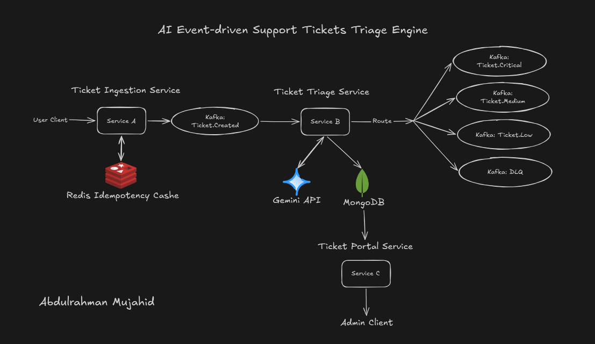
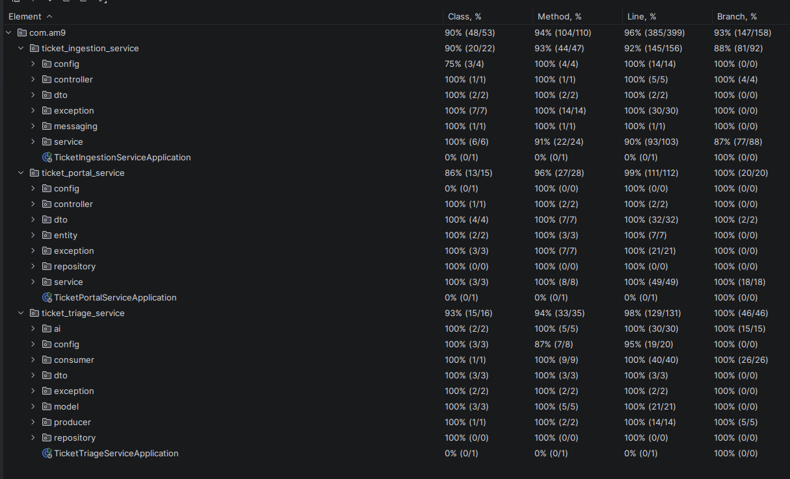

# AI Event-Driven Support Ticket Triage Engine

An asynchronous support-ticket pipeline backed by Kafka that accepts idempotent requests, classifies them with Gemini, and exposes the resulting ticket state through a read API.

[](https://openjdk.org/projects/jdk/21/)
[](https://spring.io/projects/spring-boot)
[](https://kafka.apache.org/)
[](https://redis.io/)
[](https://www.mongodb.com/)
[](https://ai.google.dev/gemini-api/docs)
[](https://docs.docker.com/compose/)
[](LICENSE)

## What this demonstrates

This project explores the boundary between a reliable synchronous intake API and an asynchronous AI workflow. Ticket submission is protected by Redis-backed idempotency and Kafka producer acknowledgements, while a separate consumer persists triage state, validates Gemini output before trusting it, and publishes urgency-specific events. The read portal is deliberately isolated from the classification path: it serves the persisted ticket record and its status history from MongoDB.

## Architecture



The ingestion service accepts a ticket at `POST /api/v1/tickets`, uses the caller's `Idempotency-Key` to prevent conflicting or duplicate submissions, then publishes a JSON event to `tickets.created`. The triage service consumes that topic, creates or reloads the ticket's MongoDB record, and asks Gemini for a structured urgency, category, and reason. It normalizes and validates that result before updating the ticket and publishing a second event to `tickets.critical`, `tickets.medium`, or `tickets.low`; invalid triage results are recorded as failed and handed to `tickets.dlq` by the listener error handler. The portal does not consume those routed topics—it queries the same MongoDB ticket collection to provide list and detail views of the persisted triage result and status history.

## Tech stack

| Technology | Purpose | Why it is used here |
| --- | --- | --- |
| Java 21 + Spring Boot 3.5.16 | Service runtime and application framework | All three services use the same Java and Boot baseline, while Spring supplies web, validation, data, and configuration support appropriate to each service. |
| Apache Kafka + Spring Kafka | Event backbone | Ingestion publishes `tickets.created`; triage consumes it with three listener threads and routes validated results to urgency-specific topics. This keeps accepting a ticket separate from the later Gemini call. |
| Redis 7.2 | Idempotency store for ticket creation | The ingestion service atomically claims a hashed `Idempotency-Key`, compares a request fingerprint, and caches completed responses for the configured 3,600-second TTL. |
| MongoDB 7.0 + Spring Data MongoDB | Ticket state and query model | Triage persists the original ticket, classification fields, and status history in one document; the portal can then read that model without depending on Kafka consumption. |
| Google Gemini via Spring AI 1.1.8 | Structured ticket classification | The triage service calls the configured Gemini model with a constrained schema, then independently validates urgency and field lengths before it changes ticket state or routes an event. |
| springdoc OpenAPI 2.8.17 | HTTP API documentation | The two HTTP services expose their controller contracts at the configured Swagger UI path, alongside request validation and error responses. |
| Docker Compose | Local multi-service environment | Compose starts Kafka, Redis, MongoDB, and the services on one network, with dependency health checks before the dependent services start. |

## Services

### ticket-ingestion-service

Accepts support tickets and publishes creation events after an idempotency check. A successful request returns `202 Accepted` only after the Kafka send completes; retrying the same key and request body returns the cached response, while reusing a key with a different body is rejected.

- Port: `8080` (published by Docker Compose)
- Endpoint: `POST /api/v1/tickets` — requires an `Idempotency-Key` header and a JSON body containing `subject`, `description`, and `userEmail`
- Depends on: Redis for idempotency records and Kafka for `tickets.created`

### ticket-triage-service

Consumes `tickets.created`, persists or reloads the ticket in MongoDB, classifies it with Gemini, and validates the structured result before recording the new status. It publishes the resulting event to `tickets.critical`, `tickets.medium`, or `tickets.low`; failures handled by the Kafka error policy are directed to `tickets.dlq`.

- Port: `8081` is configured, but Docker Compose does not publish it to the host
- HTTP endpoints: none; this service is driven by its Kafka listener
- Depends on: Kafka, MongoDB, and `GEMINI_API_KEY`

### ticket-portal-service

Provides the read side of the system. It queries MongoDB for paginated ticket summaries and individual ticket details, including the classification, reasoning, and chronological status history written by triage.

- Port: `8082` (published by Docker Compose)
- Endpoints:
    - `GET /api/v1/tickets` — paginated list; supports `page`, `size`, `sortBy`, and `direction`
    - `GET /api/v1/tickets/{ticketId}` — one triaged ticket and its status history
- Depends on: MongoDB

## Getting started

### Prerequisites

- Docker and Docker Compose
- A Gemini API key

Copy the supplied environment template, then replace the API-key placeholder:

```bash
cp .env.example .env
```

Set `GEMINI_API_KEY` in `.env`. The Compose file supplies the service-to-service Redis, Kafka, and MongoDB connection values itself; the other variables in `.env.example` document the values used for container networking and direct local runs.

Build and start the complete stack:

```bash
docker compose up --build
```

Docker Compose publishes the ingestion API on `http://localhost:8080` and the portal API on `http://localhost:8082`. It also publishes Redis on `6379`, MongoDB on `27017`, and Kafka's host listener on `29092`. The triage service runs on the Compose network and has no host port mapping.

## Testing



The repository contains JUnit 5 & Mockito tests across all three services. They include mocked unit tests for the Redis idempotency workflow, Kafka producer and topic configuration, triage validation and consumer state transitions, and portal query mapping; HTTP controller slices cover request validation and error handling for the ingestion and portal APIs. Line coverage is 92% for ticket-ingestion-service, 99% for ticket-portal-service, and 98% for ticket-triage-service.

Run each service's test suite with its Maven wrapper:

```bash
(cd ticket-ingestion-service && ./mvnw test)
(cd ticket-triage-service && ./mvnw test)
(cd ticket-portal-service && ./mvnw test)
```

## API documentation

springdoc is configured with the Swagger UI path `/swagger-ui.html` for the HTTP services:

- Ingestion API: `http://localhost:8080/swagger-ui.html`
- Portal API: `http://localhost:8082/swagger-ui.html`

The triage service has no HTTP controller or springdoc dependency, so it does not expose a Swagger UI.

## Observability

Basic observability is configured via Spring Boot Actuator on the ingestion and portal services:

- Ingestion: `http://localhost:8080/actuator/health`, `http://localhost:8080/actuator/info`
- Portal: `http://localhost:8082/actuator/health`, `http://localhost:8082/actuator/info`

## Project structure

```text
.
├── docker-compose.yml
├── .env.example
├── docs/
│   └── images/
├── ticket-ingestion-service/
│   ├── Dockerfile
│   ├── pom.xml
│   └── src/
│       ├── main/       # REST intake, Redis idempotency, Kafka producer
│       └── test/
├── ticket-triage-service/
│   ├── Dockerfile
│   ├── pom.xml
│   └── src/
│       ├── main/       # Kafka consumer, Gemini classification, MongoDB writer
│       └── test/
└── ticket-portal-service/
    ├── Dockerfile
    ├── pom.xml
    └── src/
        ├── main/       # REST read API and MongoDB query service
        └── test/
```

## License

Distributed under the [MIT License](LICENSE).

## Contact

- Email: [abdulrahman.mujahid09@gmail.com](mailto:abdulrahman.mujahid09@gmail.com)
- LinkedIn: [linkedin.com/in/abdulrahman-mujahid](https://www.linkedin.com/in/abdulrahman-mujahid/)
